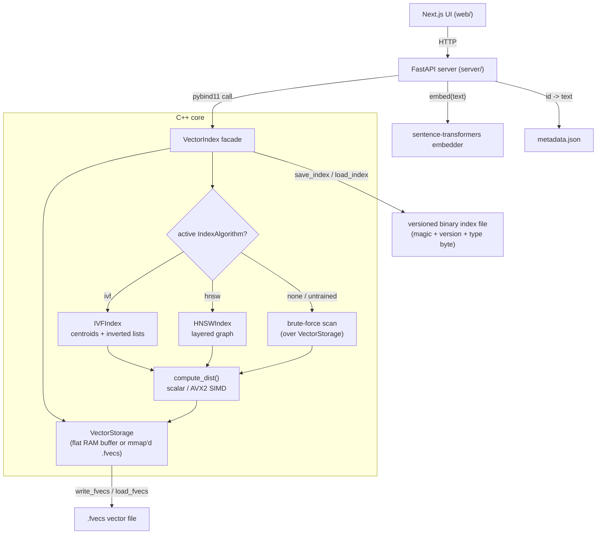

# VeloxDB — Interview Prep & Design Notes

A revision sheet for explaining this project in SDE interviews. Covers the *why* behind each decision, the tradeoffs, the things you'd say when an interviewer pushes, and a roadmap of resume-worthy improvements.

> **One-line pitch:** "I built an embedded vector database in C++17 with AVX2 SIMD distance kernels, two pluggable ANN index algorithms — IVF (K-Means inverted-file) and HNSW (hierarchical navigable small world graph) behind a shared abstraction — memory-mapped persistence for larger-than-RAM datasets, pybind11 Python bindings, and a FastAPI + Next.js layer for semantic text search."

---

## 1. The 30-second / 2-minute / deep-dive pitch

**30 sec:** VeloxDB is a from-scratch vector database. The hot path — distance computation and indexing — is native C++ with hand-written AVX2 SIMD. It supports two interchangeable approximate-nearest-neighbor index algorithms behind a common interface: an IVF index (K-Means clustering + inverted lists) and an HNSW index (a multi-layer proximity graph), so search is sub-linear instead of brute force either way. Data persists in a versioned binary format — the `.fvecs` layout for raw vectors, memory-mapped on load so you can query datasets bigger than RAM, and a self-describing index file with a magic-byte/version header. A pybind11 layer exposes it to Python, and a FastAPI server + Next.js UI turn it into a semantic search engine using sentence-transformer embeddings.

**2 min:** Add the layering (C++ core → pybind11 → FastAPI → Next.js), the storage/algorithm split inside the C++ core (`VectorStorage` + an `IndexAlgorithm` interface implemented by `IVFIndex` and `HNSWIndex`), the two distance metrics (Euclidean / cosine, each with scalar + SIMD variants), the brute-force-vs-IVF-vs-HNSW search modes, the concurrency model (one coarse `shared_mutex`), and the persistence story (separate files for vectors, index, and metadata; a version discriminator so old IVF-only index files still load).

**Deep dive:** Be ready to whiteboard the IVF search (compare query to *k* centroids → pick nearest cluster(s) via `nprobe` → scan those buckets with a bounded max-heap), the K-Means training loop, the HNSW build/search algorithm (layered graph, greedy descent, `search_layer` best-first traversal, neighbor pruning), the `.fvecs` byte layout, and how `mmap` + pointer arithmetic gives you zero-copy random access to any vector.

---

## 2. System flow (diagram)



**Request-level walkthrough** (what actually happens on each call):
- **Add a document** — UI → `POST /documents` → server embeds the text → `VectorIndex.add_vector()` (write lock) appends to `VectorStorage`, marks the index stale → metadata sidecar records `id → text`.
- **Train** — UI → `POST /train` → `VectorIndex.build_index()` / `build_index_hnsw()` (write lock) hands `VectorStorage` to a fresh `IVFIndex`/`HNSWIndex`, which reads every vector, builds its structure, and becomes the new active `algo_`.
- **Search** — UI → `POST /search` → server embeds the query (or uses a raw vector) → `VectorIndex.search()` (read lock): if no algorithm is trained yet, brute-force scan `VectorStorage`; otherwise delegate to the active algorithm's `search()`, which still ultimately calls `compute_dist()` against raw pointers into `VectorStorage`.
- **Save/load** — the facade writes/reads the common file header (magic bytes, version, type discriminator, dim) itself, then delegates the algorithm-specific payload to `algo_->save()`/`load()`.

---

## 3. Core concepts you must be able to explain

### Vector / embedding similarity search
- An **embedding** maps text/images into a fixed-dim float vector where semantic similarity ≈ geometric proximity.
- "Search" = find the vector(s) closest to a query vector under some distance metric.
- This project uses `all-MiniLM-L6-v2` (384-dim) via `sentence-transformers` on the server side.

### Distance metrics ([src/metrics.cpp](src/metrics.cpp))
- **Euclidean (L2):** `Σ(aᵢ−bᵢ)²`. Note it returns the **squared** distance — you don't need the `sqrt` to rank nearest neighbors, so it's skipped for speed. Good talking point.
- **Cosine distance:** `1 − (a·b)/(‖a‖‖b‖)`. Measures angle, scale-invariant — preferred for normalized text embeddings.
- Each metric has a scalar and an AVX2 variant, selectable at runtime via `set_simd()`.
- Both `IVFIndex` and `HNSWIndex` call the exact same free-function distance kernels through one shared `compute_dist()` dispatcher ([include/index_base.hpp](include/index_base.hpp)) — no duplication, no algorithm-specific distance code.

### SIMD / AVX2 ([src/metrics.cpp](src/metrics.cpp))
- `__m256` holds **8 floats**; one `_mm256_*_ps` instruction processes all 8 lanes at once (data-level parallelism).
- Pattern: accumulate partial sums in a vector register across the bulk of the array, then a **horizontal reduction** (store to buffer, sum the 8 lanes), then a **scalar tail loop** for the remaining `n % 8` elements.
- Uses `_mm256_loadu_ps` (**u** = unaligned) so it works on arbitrary `std::vector` data without alignment guarantees.
- **Tradeoff:** requires AVX2-capable CPU; falls back to scalar. Float accumulation order differs between scalar and SIMD, so results aren't bit-identical (floating-point non-associativity) — fine for ANN, worth mentioning.

### Storage/algorithm separation ([include/storage.hpp](include/storage.hpp), [include/index_base.hpp](include/index_base.hpp))
- `VectorStorage` owns *only* raw vector bytes — either an in-RAM flat `std::vector<float>` (row-major, `flat[i*dim + d]`) or a read-only `mmap`'d `.fvecs` file. It knows nothing about clustering or graphs.
- `IndexAlgorithm` is a small abstract interface (`build`, `search`, `save`, `load`, `is_built`, `type_name`) implemented by `IVFIndex` and `HNSWIndex`. Both take a `const VectorStorage&` and a query pointer — they never own vector data themselves, they just read it.
- `VectorIndex` (the facade, [include/vector_db.hpp](include/vector_db.hpp)) glues the two together: it holds a `VectorStorage` plus a `std::unique_ptr<IndexAlgorithm>` for whichever algorithm is currently trained, and is the *only* class that knows about locking and file headers.
- **Why this shape and not something fancier:** this is a textbook Strategy pattern — deliberately minimal (one interface, two implementations, one flat `IndexParams` hyperparameter struct shared by both) rather than a template/visitor/registry framework, because there are exactly two algorithms today. A third (e.g. product quantization) would be the trigger to revisit that flatness — good "when would you refactor this" answer.

### IVF index (Inverted File) ([include/ivf_index.hpp](include/ivf_index.hpp), [src/ivf_index.cpp](src/ivf_index.cpp))
- **Train:** run K-Means to produce `num_clusters` centroids; assign every vector to its nearest centroid; build `inverted_lists[c] = [vector ids in cluster c]`.
- **Search:** compare query to all `num_clusters` centroids (cheap), pick the `nprobe` nearest clusters, then scan **only those buckets**, keeping the top-k via a bounded max-heap (size `k`, replace-if-closer).
- Turns an O(N·d) brute-force scan into roughly O(k·d) centroid scan + O(nprobe·(N/k)·d) bucket scan. With `k ≈ √N` and `nprobe=1` that's ~O(√N·d).
- **It's approximate (ANN):** the true nearest neighbor can live in a *neighboring* cluster you didn't probe. `nprobe` is the recall/speed knob — probe more clusters, better recall, slower.

### K-Means ([src/ivf_index.cpp](src/ivf_index.cpp) `IVFIndex::build`)
- Lloyd's algorithm: random init (shuffle indices, take first *k*) → assign step (each vector to its nearest centroid) → update step (mean of assigned vectors) → repeat for `epochs`.
- Vectors are pre-cached into one contiguous flat buffer before training starts (a no-op copy for in-RAM storage, a real cache-friendliness win for mmap'd data) so the hot inner loop never re-touches storage/mmap machinery.
- **Talking points:** sensitive to init (k-means++ would be better), can produce empty clusters (the code guards `counts[c] > 0`), runs a fixed iteration count with no convergence check.

### HNSW index (Hierarchical Navigable Small World) ([include/hnsw_index.hpp](include/hnsw_index.hpp), [src/hnsw_index.cpp](src/hnsw_index.cpp))
- **Structure:** a multi-layer proximity graph. Every vector is a node in layer 0; each node is also promoted to some number of layers above that, chosen at insertion by drawing a random `level` from an exponential-decay distribution (`level = ⌊−ln(uniform())·(1/ln M)⌋`) — so most nodes only live in layer 0, and progressively fewer nodes reach each higher layer. Higher layers are sparse "express lanes" for coarse navigation; layer 0 has every node and is where the fine-grained search happens.
- **Build (insert one vector at a time):**
  1. Draw the new node's `level`.
  2. Greedily descend from the current global entry point, from the top layer down to `level+1`, at each layer doing a 1-nearest-neighbor walk (`ef=1`) to find a good jump-off point for the next layer down. This is O(log N)-ish because each layer roughly halves the remaining "distance" to the target region.
  3. From `min(level, max_level)` down to layer 0: run a **best-first search** (`search_layer`, `ef=ef_construction`) to gather candidate neighbors at that layer, connect the new node to the closest `M` of them (`M_max0 = 2M` at layer 0, since layer 0 needs denser connectivity), and if that pushes any existing neighbor's list over its cap, re-sort and prune it back down to the closest `M`/`M_max0`.
  4. If `level` exceeds the graph's current max level, the new node becomes the new global entry point.
- **`search_layer`** is the workhorse, reused identically by build (`ef=ef_construction`) and query (`ef=ef_search`): maintain a min-heap of candidates to expand and a max-heap of the best `ef` results found so far; repeatedly pop the closest unvisited candidate, expand its neighbors at that layer, and stop expanding a branch once the closest remaining candidate is farther than the current worst kept result (early termination — this is what keeps it sub-linear).
- **Query:** same greedy descent as build (down to layer 1, `ef=1`) to find a good entry point, then one `search_layer` call at layer 0 with `ef = max(ef_search, k)`, return the closest `k`.
- **Neighbor selection is simple closest-M pruning**, not the original paper's diversity-aware heuristic (which also tries to keep neighbors spread out directionally, not just close). Deliberate simplification — cheaper, "good enough" for well-distributed embeddings, but can lose recall on tightly clustered/anisotropic data. Great "what would you improve" answer.
- **Rebuild-only, by design:** `build_index_hnsw()` always builds a fresh graph from everything currently in `VectorStorage`, exactly like IVF's `build_index()`. HNSW *can* support true incremental insertion (add one node to a live graph without touching the rest), which is one of its headline advantages over IVF — this implementation intentionally doesn't do that yet, to keep the two algorithms' UX/semantics symmetric and the locking model simple (see Concurrency below).

### IVF vs HNSW — side-by-side

| Dimension | IVF (K-Means inverted-file) | HNSW (layered graph) |
|---|---|---|
| Core structure | Flat list of centroids + per-cluster inverted lists | Multi-layer proximity graph, node degree capped at `M`/`M_max0` |
| Build cost | O(epochs · N · num_clusters · d) — a few passes over all vectors | O(N · ef_construction · log N · d) — per-node graph search + connect, amortized over ~log N layers |
| Build memory (extra, beyond raw vectors) | O(num_clusters · d) centroids + O(N) ints for inverted lists | O(N · M) ints for neighbor lists (denser at layer 0) |
| Query cost | O(num_clusters·d) + O(nprobe·(N/num_clusters)·d) — linear in probed bucket size | O(ef_search · log N · d) — roughly logarithmic in N |
| Recall knob | `nprobe` (clusters probed) | `ef_search` (search breadth at layer 0) |
| Typical recall/latency profile | Good recall needs a larger `nprobe`, which scales query cost roughly linearly | Tends to reach high recall at lower query latency than IVF for the same dataset, once built |
| Incremental insert | No — always requires a full retrain (this project already treats it that way) | Algorithm supports it in theory; this project deliberately doesn't (rebuild-only, matches IVF's semantics) |
| Simplicity to implement/reason about | Simpler — a handful of loops, no graph invariants to maintain | More moving parts — layer assignment, greedy descent, neighbor pruning, entry-point bookkeeping |
| When you'd pick it | Smaller/simpler deployments, fast retrains, memory-constrained, "good enough" recall | Larger datasets, query-latency-sensitive workloads, can afford a slower build and more memory |

---

### Concurrency ([include/vector_db.hpp](include/vector_db.hpp), [src/index.cpp](src/index.cpp))
- One `std::shared_mutex` in the `VectorIndex` facade guards *everything* — storage and whichever index algorithm is active. Reads (`search`, `get_vector`, `write_fvecs`) take a shared lock; writes (`add_vector`, `build_index*`, `load_index`) take a unique lock.
- **Why one coarse lock and not fine-grained per-component locking:** simplicity and correctness first — a rebuild (K-Means or HNSW graph construction) mutates a lot of shared state, and partial/fine-grained locking around that is a good way to introduce subtle races for very little real concurrency benefit at this scale. Real production systems would shard instead of trying to make one giant structure thread-safe under heavy concurrent writes.

### Memory-mapped I/O ([src/storage.cpp](src/storage.cpp))
- `mmap` maps the file into the process address space; the OS pages data in on demand instead of `read()`-ing the whole file into RAM.
- `raw_vec_ptr(i)` / `get_vector(i)` do **pointer arithmetic** into the mapped region — `base + i*row_size + sizeof(int)` — giving zero-copy O(1) random access.
- `MAP_PRIVATE | PROT_READ` → read-only; that's why `add_vector` throws when the storage is backed by mmap (you can't append to a memory-mapped read-only file).

### The `.fvecs` format
- Per vector: a 4-byte `int` dimension header, followed by `dim` little-endian `float32`s.
- `num_vectors = file_size / (4 + dim*4)`. Self-describing, trivially seekable, FAISS-compatible.

### Versioned index persistence ([src/index.cpp](src/index.cpp) `save_index`/`load_index`)
- File header: magic bytes (`VLXF`) → version (`uint16`) → 1-byte index-type discriminator (`0`=IVF, `1`=HNSW) → `dim` → algorithm-specific payload (`IndexAlgorithm::save`/`load`, which never has to know about the header).
- Bumping the version added the discriminator byte; **old version-1 files (written before HNSW existed, always IVF, no discriminator) still load** via an explicit legacy-format branch in `load_index` that reads the old byte order (`num_clusters` then `dim`, no type byte) and feeds it into `IVFIndex::load_legacy_v1`. This is the "how do you evolve a binary format without breaking old data" story.

---

## 4. Architecture & layering

```
Next.js UI (web/)  ──HTTP──▶  FastAPI (server/)  ──pybind11──▶  C++ core (src/, include/)
   ingest/search/train          embeds text,                    VectorIndex facade
                                 holds global state,               ├─ VectorStorage (flat / mmap)
                                 metadata JSON                     └─ IndexAlgorithm*
                                                                       ├─ IVFIndex (K-Means)
                                                                       └─ HNSWIndex (graph)
```

(See the mermaid diagram in §2 for the full request-level flow.)

- **Why C++ core:** distance math and indexing are the hot path; manual memory layout + SIMD + no GC.
- **Why pybind11:** expose the fast core to Python's ecosystem (embeddings, web frameworks) without rewriting it.
- **Why `VectorStorage` / `IndexAlgorithm` split:** storage (raw bytes, mmap vs RAM) is a concern completely orthogonal to *how* you index those bytes; separating them means adding HNSW required zero changes to storage or distance code, and both algorithms are unit-testable against a real `VectorStorage` without any server/Python involved.
- **Why split files** (`vectors.fvecs`, `index.ivf`, `metadata.json`): vectors are the source of truth, the index is a derived/rebuildable artifact, and text metadata is a Python-side concern the C++ core doesn't know about. Clean separation of responsibilities.
- **Server state** ([server/state.py](server/state.py)): a single global `VectorIndex` plus `vector_count`/`dim`/`is_indexed` flags, hydrated from disk on startup. *(Note: the server currently only drives the IVF path — `build_index`/`nprobe` — since HNSW wiring through the FastAPI/Next.js layers is intentionally out of scope for now and is the natural next increment.)*

---

## 5. Key tradeoff decisions (interviewers love these)

| Decision | Chosen | Alternative | Why / tradeoff |
|---|---|---|---|
| Index abstraction | one small `IndexAlgorithm` interface + one flat `IndexParams` struct | per-algorithm param subclasses, templates, a plugin registry | Only two implementations exist; a heavier framework would be speculative. Revisit if a third algorithm (e.g. PQ) shows up. |
| Index types | both IVF (flat/cluster) and HNSW (graph) | pick just one | Lets you compare recall/latency/build-time/memory tradeoffs directly and talk about *when* you'd choose each (see the comparison table in §3). |
| HNSW neighbor pruning | simple closest-M | the paper's diversity-aware heuristic | Simpler, less code; can lose recall on clustered/anisotropic data. Named as a concrete, scoped future improvement. |
| HNSW mutation model | rebuild-only (mirrors IVF) | true incremental insert into a live graph | Keeps both algorithms' API/locking semantics symmetric and simple; sacrifices one of HNSW's headline advantages in exchange for consistency. |
| Distance return | squared L2 (no sqrt) | true L2 | sqrt is monotonic — unnecessary for ranking. Saves a sqrt per comparison. |
| SIMD | runtime toggle (AVX2) | always-on / compile-time / AVX-512 | Portability + ability to A/B benchmark scalar vs SIMD. |
| Storage layout | flat contiguous `std::vector<float>` (or mmap) | `vector<vector<float>>` row-of-rows | Contiguous memory is cache-friendly and a prerequisite for the SIMD wins; row-of-rows would scatter across the heap. |
| Concurrency | one coarse `shared_mutex` in the facade | fine-grained per-component locks, sharding | Simple, correct, no lock-ordering bugs; doesn't allow concurrent reads during a long rebuild. Production systems would shard instead. |
| Persistence | custom versioned binary + magic bytes/discriminator, explicit legacy-v1 read path | SQLite, protobuf, FAISS index; or just break old files on format change | Minimal deps, full control, backward compatible. No schema-evolution framework beyond the hand-rolled version switch. |
| Search result | top-k with distances, bounded max-heap | top-1 only | Real product requirement; heap keeps it O(N log k) instead of a full sort. |
| `nprobe` / `ef_search` | tunable per-call parameter | hardcoded | Exposes the recall/latency knob to the caller for both algorithms. |
| Bindings | pybind11 | ctypes, Cython, raw CPython API | Ergonomic C++↔Python, header-only, STL conversions for free. |

---

## 6. Complexity cheat-sheet

| Operation | Cost |
|---|---|
| `add_vector` | O(d) amortized |
| Brute-force search | O(N·d) |
| IVF train (K-Means) | O(epochs · N · k · d) |
| IVF search | O(k·d) centroid scan + O(nprobe·(N/k)·d) bucket scan |
| HNSW build | ≈O(N · ef_construction · log N · d) — each insertion does a handful of `search_layer` calls across ~log N layers |
| HNSW search | ≈O(ef_search · log N · d) — logarithmic in N vs IVF's linear-in-bucket-size scan, at the cost of graph memory (O(N·M) edges) and a slower build |
| `get_vector` (mmap) | O(d) copy, O(1) seek |
| SIMD speedup | ~theoretical 8× on the distance inner loop (float32 lanes) |

---

## 7. Known issues / things to fix (great "what would you improve" answers)

These are real, in the current code — owning them shows engineering maturity:

1. **HNSW neighbor pruning is simple closest-M**, not the paper's diversity-aware heuristic — can hurt recall on clustered/anisotropic embeddings. Upgrading this is a scoped, well-understood improvement.
2. **HNSW is rebuild-only** — `add_vector` doesn't incrementally update a live graph; you must call `build_index_hnsw()` again from scratch after adding vectors. Losing true incremental insert is a deliberate simplicity tradeoff, not a limitation of the algorithm itself.
3. **One coarse `shared_mutex`** — correct and simple, but a long rebuild (K-Means or HNSW graph construction) blocks all reads for its duration; there's no sharding or finer-grained locking.
4. **No empirical benchmark comparing IVF vs HNSW** yet (recall@k, QPS, build time, memory) on a standard dataset — now that both index families exist for real, this is the natural next step to turn the comparison into a resume-worthy, numbers-backed story.
5. **`IndexParams` is one flat struct** shared by both algorithms' hyperparameters (`num_clusters`/`epochs`/`nprobe` for IVF, `M`/`ef_construction`/`ef_search` for HNSW) — deliberately minimal for exactly two implementations; would need a different shape (e.g. `std::variant`, or per-type params) if a third algorithm were added.
6. **K-Means** still uses fixed epoch count with no convergence check, and random (not k-means++) initialization.
7. **No thread-safe *incremental* update path** for either index — any topology change requires a full rebuild under the write lock.
8. **No delete/update, metadata filtering, or quantization** — vectors are append-only, full-vector float32 storage, and the metadata store (text) is a separate, decoupled JSON sidecar with no query integration.
9. **Server/frontend only drive IVF today** — `build_index_hnsw`/`ef_search` exist in the C++ core and Python bindings but aren't yet wired into the FastAPI schemas or the Next.js UI (deliberately out of scope for the current increment).

---

## 8. Likely interview questions & crisp answers

- **"Why implement two index types instead of just picking one?"** They sit at different points on the recall/latency/build-time/memory curve — IVF is cheap to build and low-memory but scans are linear in bucket size; HNSW gives logarithmic query time via a navigable graph at the cost of a heavier build and more memory for edges. Implementing both behind one interface lets me *compare* them instead of asserting one is better.
- **"How did you keep IVF and HNSW from becoming tangled together?"** Extracted `VectorStorage` (owns raw vector bytes/mmap, nothing algorithm-specific) and a small `IndexAlgorithm` interface (`build`/`search`/`save`/`load`); both `IVFIndex` and `HNSWIndex` only ever see a `const VectorStorage&` and never touch each other. The facade (`VectorIndex`) is the only place that knows about locking and file headers.
- **"Why one flat `IndexParams` struct instead of a class per algorithm?"** With exactly two implementations, a params hierarchy or generic framework would be speculative complexity. Each concrete class just reads the fields it needs. I'd revisit this the moment a third algorithm shows up.
- **"How does HNSW's search complexity beat IVF's?"** IVF's bucket scan is linear in `N/num_clusters`; HNSW's layered graph gives you roughly logarithmic descent because each layer is exponentially sparser, so you narrow in on the right neighborhood in O(log N) hops before the bounded best-first search at layer 0.
- **"Walk me through inserting a node into the HNSW graph."** Draw a random level from an exponential distribution; greedily descend the existing graph from the entry point down to that level (`ef=1` walks); then from that level down to 0, gather `ef_construction` candidates per layer via best-first search, connect to the closest `M` (or `M_max0` at layer 0), and prune any neighbor that now exceeds its cap back down to its closest `M`.
- **"Why is your HNSW rebuild-only when the algorithm supports incremental insert?"** Deliberate scope/consistency choice — it mirrors IVF's existing "add invalidates, rebuild refreshes" semantics and avoids reasoning about concurrent graph mutation under the shared lock. I know what true incremental insert would require (per-node locking or a queue of pending inserts) and chose not to build it yet.
- **"Why closest-M pruning instead of the paper's heuristic?"** Simpler and less code; it's "good enough" when embeddings are reasonably well-distributed, but can under-connect the graph in directions that matter on tightly clustered data, hurting recall. Named as a concrete follow-up rather than an accident.
- **"How do you handle backward compatibility when your on-disk format changes?"** Magic bytes + explicit version number + (from version 2 onward) a 1-byte type discriminator. `load_index` branches on version: version 1 reads the old byte order directly into `IVFIndex::load_legacy_v1`; version 2 reads the discriminator and dispatches to the right concrete `IndexAlgorithm`.
- **"Why is your search approximate?"** Both index types trade exactness for sub-linear latency — IVF by only scanning `nprobe` clusters, HNSW by doing a bounded best-first graph search instead of exhaustively comparing every vector. The true nearest neighbor can be missed in either case; that's the ANN bargain.
- **"How does SIMD give a speedup?"** One AVX2 instruction does 8 float ops; the distance loop is the bottleneck, so vectorizing it ~8× the arithmetic throughput, minus the horizontal-reduction and tail-loop overhead. It's shared by every algorithm since they all call the same `compute_dist` dispatcher.
- **"How do you handle data bigger than RAM?"** `mmap` the `.fvecs` file via `VectorStorage`; the OS pages it in on demand and pointer arithmetic gives zero-copy random access — same storage layer, whichever index algorithm is active on top of it.
- **"Why `num_clusters ≈ √N`?"** Balances the two halves of IVF cost: centroid scan O(k) grows with k, bucket scan O(N/k) shrinks with k; the sum is minimized near √N.
- **"What's the failure mode of K-Means here?"** Bad random init → poor clusters; no convergence check (fixed epochs); empty clusters; sensitive to scale (cosine vs L2 matters).
- **"How would you make it production-grade?"** See roadmap below — benchmarking, incremental HNSW updates, sharded concurrency, quantization, wiring HNSW through the API/UI, observability.
- **"Why C++ and Python together?"** Performance-critical kernels in C++, ecosystem/glue (embeddings, HTTP) in Python; pybind11 bridges them.

---

## 9. Resume-worthy roadmap (ordered by impact ÷ effort)

**High impact, low effort:**
1. **Benchmark IVF vs HNSW head-to-head** — recall@k, QPS, build time, memory, on a standard dataset (e.g. SIFT1M). This is now the single highest-leverage thing to do: two real index families exist, but there's no number backing up "HNSW is faster to query, IVF is faster to build." Put the graph in the README.
2. **Wire HNSW through the FastAPI/Next.js layers** — `index_type` selector on `/train`, `ef_search` on `/search`, a dropdown in the UI. Currently deliberately scoped out of the C++/Python-package-only change; natural next PR.
3. **Upgrade HNSW neighbor selection** to the paper's diversity-aware heuristic and measure the recall delta vs the current simple closest-M pruning.

**Medium effort, strong signal:**
4. **True incremental HNSW insertion** — add a node to a live graph without a full rebuild; talk through what it costs in locking complexity vs the current rebuild-only design.
5. **Delete / update support** — tombstones + periodic re-index; genuinely hard in both IVF and HNSW, shows depth.
6. **Scalar quantization (int8) or PQ (product quantization)** — shrink memory 4×+ and speed up distance; classic vector-DB technique, very interview-relevant, and specifically helps HNSW's heavier per-node memory footprint.
7. **Sharded / finer-grained concurrency** beyond the single coarse lock — talk about it as a real systems problem (how do you shard an HNSW graph vs an IVF index differently?).

**Polish / breadth:**
8. **Metadata filtering** ("search where category = X") — pre/post-filter on the metadata store.
9. **Batched search** API + SIMD over multiple queries.
10. **Observability** — latency/recall metrics endpoint, structured logging.
11. **CI** — GitHub Actions running the C++ (GoogleTest) and Python tests, plus the benchmark on a fixed dataset to catch regressions.
12. **Packaging** — multi-platform wheels (cibuildwheel) with runtime AVX2 detection so it works on non-AVX2 machines.

---

## 10. Two-line résumé bullet templates

> *Built **VeloxDB**, an embedded vector database in C++17 with hand-written AVX2 SIMD distance kernels and two pluggable ANN index algorithms — IVF/K-Means and HNSW — behind a shared `IndexAlgorithm` interface, achieving **~Nx** faster search than brute force at **R%** recall@10 on SIFT1M.*

> *Designed memory-mapped `.fvecs` persistence for larger-than-RAM datasets, a versioned binary index format with backward-compatible legacy loading, and exposed the core via pybind11 to a FastAPI + Next.js semantic-search stack using sentence-transformer embeddings.*

*(Fill in the **Nx / R%** once you've run the benchmark in roadmap item #1 — concrete numbers are the difference between a good and a great bullet.)*

---

## 11. File map (where to point during a walkthrough)

| Area | File |
|---|---|
| Facade / public API surface | [include/vector_db.hpp](include/vector_db.hpp) · [src/index.cpp](src/index.cpp) |
| Raw vector storage (flat + mmap) | [include/storage.hpp](include/storage.hpp) · [src/storage.cpp](src/storage.cpp) |
| Index algorithm interface + shared params/distance dispatch | [include/index_base.hpp](include/index_base.hpp) |
| IVF (K-Means) | [include/ivf_index.hpp](include/ivf_index.hpp) · [src/ivf_index.cpp](src/ivf_index.cpp) |
| HNSW (graph) | [include/hnsw_index.hpp](include/hnsw_index.hpp) · [src/hnsw_index.cpp](src/hnsw_index.cpp) |
| Distance kernels (scalar + AVX2) | [src/metrics.cpp](src/metrics.cpp) · [include/metrics.hpp](include/metrics.hpp) |
| Python bindings | [bindings/python_bindings.cpp](bindings/python_bindings.cpp) |
| C++ unit tests | [tests/cpp/test_core.cpp](tests/cpp/test_core.cpp) |
| Python smoke tests (compiled module, no server) | [tests/api/test_hnsw.py](tests/api/test_hnsw.py) |
| REST API | [server/app.py](server/app.py) |
| Server state / persistence | [server/state.py](server/state.py) |
| Embeddings | [server/embedder.py](server/embedder.py) |
| Web UI | [web/app/](web/app/) |
