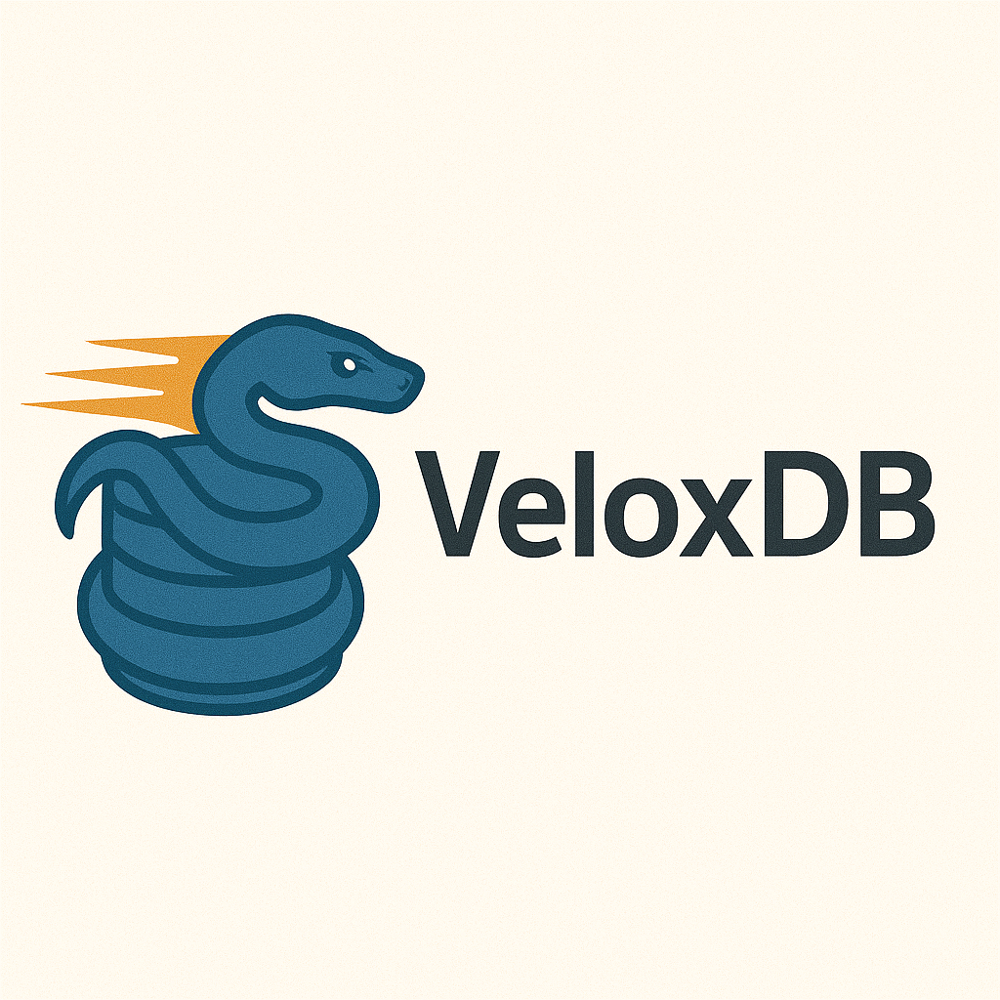
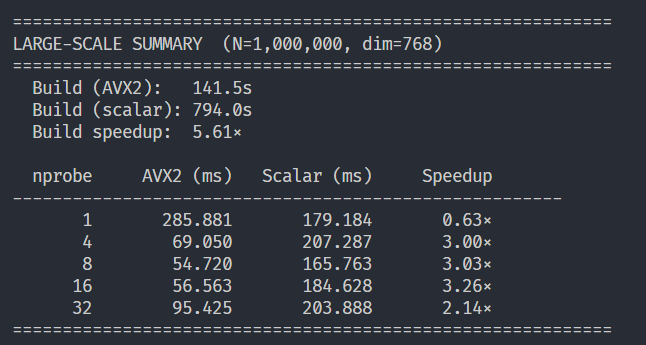

<div align="center">
  
</div>


**High-Performance Embedded Vector Database**

[](https://www.python.org/downloads/)
[](https://opensource.org/licenses/MIT)
[](https://isocpp.org/)

## Overview

VeloxDB is a production-ready vector database engineered for high-performance similarity search operations. The system leverages native C++ implementation with AVX2 SIMD instruction sets to deliver optimal performance for vector-intensive workloads. With support for datasets exceeding available memory through memory-mapped file I/O and intelligent indexing via Inverted File structures, VeloxDB provides enterprise-grade scalability while maintaining a simple developer experience.

## Key Features

- **High Performance**: Native C++ implementation with AVX2 SIMD instructions for vectorized distance calculations
- **Scalable Architecture**: Memory-mapped file support enables handling datasets larger than available RAM
- **Intelligent Indexing**: Inverted File Index (IVF) with K-Means clustering for efficient approximate nearest neighbor (ANN) search
- **Python Integration**: Simple, intuitive Python API via pybind11 bindings
- **Persistent Storage**: Save and load vector databases and indices in the efficient `.fvecs` format
- **Flexible Metrics**: Support for Euclidean and Cosine distance metrics
- **REST API**: Optional FastAPI server for remote access and microservice deployments

## Installation

### From PyPI

```bash
pip install veloxdb
```

### From Source

```bash
git clone https://github.com/PranavBhatP/velox-db.git
cd velox-db
pip install .
```

**Requirements:**
- Python 3.9+
- CMake 3.15+
- C++17 compatible compiler
- AVX2-capable CPU (for SIMD optimizations)

## Quick Start

### Basic Usage

```python
import veloxdb

# Create a new vector index
db = veloxdb.VectorIndex()

# Add vectors
db.add_vector([1.0, 2.0, 3.0, 4.0, 5.0])
db.add_vector([2.0, 3.0, 4.0, 5.0, 6.0])
db.add_vector([10.0, 20.0, 30.0, 40.0, 50.0])

# Build IVF index for fast search
db.build_index(num_clusters=2, max_iters=10, metric="eucl")

# Search for nearest neighbor
query = [1.1, 2.1, 3.1, 4.1, 5.1]
result_id = db.search(query, metric="eucl")
print(f"Nearest neighbor ID: {result_id}")

# Retrieve the matched vector
matched_vector = db.get_vector(result_id)
print(f"Matched vector: {matched_vector}")
```

### Persistence

```python
# Save vectors and index to disk
db.write_fvecs("vectors.fvecs")
db.save_index("index.ivf")

# Load from disk
db_loaded = veloxdb.VectorIndex()
db_loaded.load_fvecs("vectors.fvecs")
db_loaded.load_index("index.ivf")
```

### Web UI (Next.js)

A browser UI for ingesting text, training the IVF index, searching by similarity, and saving state.

**1. Build and install the core library and server dependencies:**

```bash
pip install -e .
pip install -e ".[server]"
```

**2. Start the API** (from the repository root):

```bash
python -m server.main
```

The API listens on `http://localhost:8000`. On first document ingest, sentence-transformers downloads `all-MiniLM-L6-v2` (~80MB).

**3. Start the frontend:**

```bash
cd web
cp .env.example .env.local   # optional: set NEXT_PUBLIC_API_URL
npm install
npm run dev
```

Open `http://localhost:3000`. Routes: Dashboard, Ingest, Search, Train index, Documents, Settings.

**Note:** If you have older sample data with a different vector dimension (e.g. 5-D demo vectors), clear the `data/` directory before using text embeddings (384 dimensions).

### Using the REST API Server

Start the FastAPI server:

```bash
python -m server.main
```

The server will be available at `http://localhost:8000`. Example API calls:

```bash
# Add a vector
curl -X POST http://localhost:8000/add_vectors \
  -H "Content-Type: application/json" \
  -d '{"vector": [1.0, 2.0, 3.0, 4.0, 5.0]}'

# Train the index
curl -X POST http://localhost:8000/train \
  -H "Content-Type: application/json" \
  -d '{"num_clusters": 10, "max_iters": 20, "metric": "eucl"}'

# Search by text (semantic)
curl -X POST http://localhost:8000/search \
  -H "Content-Type: application/json" \
  -d '{"query_text": "example query", "metric": "eucl"}'

# Search by raw vector
curl -X POST http://localhost:8000/search \
  -H "Content-Type: application/json" \
  -d '{"query_vector": [1.1, 2.1, 3.1, 4.1, 5.1], "metric": "eucl"}'

# Save state to disk
curl -X POST http://localhost:8000/save
```

## Architecture & Implementation

### High-Level Design

VeloxDB is architected as a three-layer system:

1. **Core Engine (C++)**: Implements the core vector storage, indexing algorithms, and distance calculations
2. **Python Bindings**: Exposes C++ functionality to Python via pybind11
3. **REST API Layer**: Optional FastAPI server for network-accessible deployments

### Core Components

#### Vector Storage

- **In-Memory Storage**: Vectors stored as `std::vector<std::vector<float>>` for fast access
- **Memory-Mapped Files**: Large datasets can be loaded from `.fvecs` files using mmap, enabling efficient access to datasets exceeding RAM capacity
- **Binary Format**: Uses the standard `.fvecs` format for efficient serialization

#### Distance Metrics

VeloxDB supports multiple distance metrics with optional SIMD acceleration:

- **Euclidean Distance**: L2 distance with AVX2 vectorized implementation
- **Cosine Distance**: Angular similarity with SIMD optimization

SIMD acceleration can be toggled via the `set_simd()` method.

#### IVF Indexing

The Inverted File Index (IVF) dramatically accelerates similarity search:

1. **Clustering**: K-Means algorithm partitions vectors into clusters
2. **Inverted Lists**: Each cluster maintains a list of vector IDs
3. **Search**: Query is compared only to centroids, then searched within the nearest cluster(s)

**Parameters:**
- `num_clusters`: Number of K-Means clusters (more clusters = faster search, but may reduce recall)
- `max_iters`: Maximum iterations for K-Means convergence
- `metric`: Distance metric (`"eucl"` for Euclidean, `"cos"` for Cosine)

#### Performance Optimizations

- **AVX2 SIMD**: Vectorized distance calculations process 8 floats per instruction
- **Memory-Mapped I/O**: Efficient disk access without loading entire datasets into RAM
- **Cache-Friendly Data Structures**: Contiguous memory layouts for optimal CPU cache utilization

## API Reference

### Python API

#### `VectorIndex`

The main class for interacting with the vector database.

```python
class VectorIndex:
    def __init__(self) -> None:
        """Initialize a new vector index."""
    
    def add_vector(self, vector: list[float]) -> None:
        """Add a vector to the index.
        
        Args:
            vector: A list of float values representing the vector.
        """
    
    def load_fvecs(self, filename: str) -> None:
        """Load vectors from a .fvecs file.
        
        Args:
            filename: Path to the .fvecs file.
        """
    
    def get_vector(self, index: int) -> list[float]:
        """Retrieve a vector by its ID.
        
        Args:
            index: The integer ID of the vector.
        
        Returns:
            The vector as a list of floats.
        """
    
    def build_index(self, num_clusters: int, max_iters: int = 10, 
                   metric: str = "eucl") -> None:
        """Build the IVF index using K-Means clustering.
        
        Args:
            num_clusters: Number of clusters for K-Means.
            max_iters: Maximum iterations for K-Means (default: 10).
            metric: Distance metric - "eucl" or "cos" (default: "eucl").
        """
    
    def search(self, query: list[float], metric: str = "eucl") -> int:
        """Search for the nearest neighbor.
        
        Args:
            query: Query vector as a list of floats.
            metric: Distance metric - "eucl" or "cos" (default: "eucl").
        
        Returns:
            The ID of the nearest neighbor vector.
        """
    
    def write_fvecs(self, filename: str) -> None:
        """Save vectors to a .fvecs file.
        
        Args:
            filename: Path where the .fvecs file will be saved.
        """
    
    def save_index(self, filename: str) -> None:
        """Save the IVF index to disk.
        
        Args:
            filename: Path where the index file will be saved.
        """
    
    def load_index(self, filename: str) -> None:
        """Load a saved IVF index from disk.
        
        Args:
            filename: Path to the index file.
        """
    
    def set_simd(self, enable: bool) -> None:
        """Enable or disable SIMD acceleration.
        
        Args:
            enable: True to enable AVX2 SIMD, False to use standard implementation.
        """
```

### REST API Endpoints

| Endpoint | Method | Description |
|----------|--------|-------------|
| `/` or `/health` | GET | Health check and stats (`vector_count`, `dim`, `is_indexed`) |
| `/documents` | POST | Embed text and store vector + metadata |
| `/documents/batch` | POST | Bulk ingest (up to 100 texts) |
| `/documents` | GET | List documents (paginated) |
| `/documents/{id}` | GET | Get document text and vector preview |
| `/embed` | POST | Embed text only (no store) |
| `/add_vectors` | POST | Add a raw float vector |
| `/train` | POST | Build/train the IVF index |
| `/search` | POST | Search by `query_text` or `query_vector` |
| `/save` | POST | Persist database, index, and metadata to disk |

## Advanced Configuration

### Optimizing Index Parameters

```python
# For small datasets (<10K vectors)
db.build_index(num_clusters=10, max_iters=20)

# For medium datasets (10K-1M vectors)
db.build_index(num_clusters=100, max_iters=15)

# For large datasets (>1M vectors)
db.build_index(num_clusters=1000, max_iters=10)
```

**Rule of thumb**: `num_clusters ≈ sqrt(num_vectors)` provides a good balance between speed and accuracy.

### Memory-Mapped Files

For datasets larger than RAM:

```python
db = veloxdb.VectorIndex()
db.load_fvecs("large_dataset.fvecs")  # Uses mmap automatically
db.load_index("large_index.ivf")
```

The database will efficiently page data from disk as needed.

## Development

### Building from Source

```bash
# Clone the repository
git clone https://github.com/PranavBhatP/velox-db.git
cd velox-db

# Install in editable mode (builds C++ extension)
pip install -e .

# Optional: API server + embeddings for the web UI
pip install -e ".[server]"

# Run C++ / Python API tests
python tests/api/test_script.py

# Run API + web UI locally
python -m server.main          # terminal 1 — http://localhost:8000
cd web && npm install && npm run dev   # terminal 2 — http://localhost:3000
```
### Benchmark results




## Contributing

Contributions are welcome! Please feel free to submit a Pull Request. For major changes, please open an issue first to discuss what you would like to change.

## License

This project is licensed under the MIT License - see the [LICENSE](LICENSE) file for details.

## Acknowledgments

- Built with [pybind11](https://github.com/pybind/pybind11) for seamless C++/Python integration
- Inspired by [FAISS](https://github.com/facebookresearch/faiss) and [Annoy](https://github.com/spotify/annoy)

## Contact

**Pranav Bhat** - pranavbhat2004@gmail.com

Project Link: [https://github.com/PranavBhatP/velox-db](https://github.com/PranavBhatP/velox-db)
